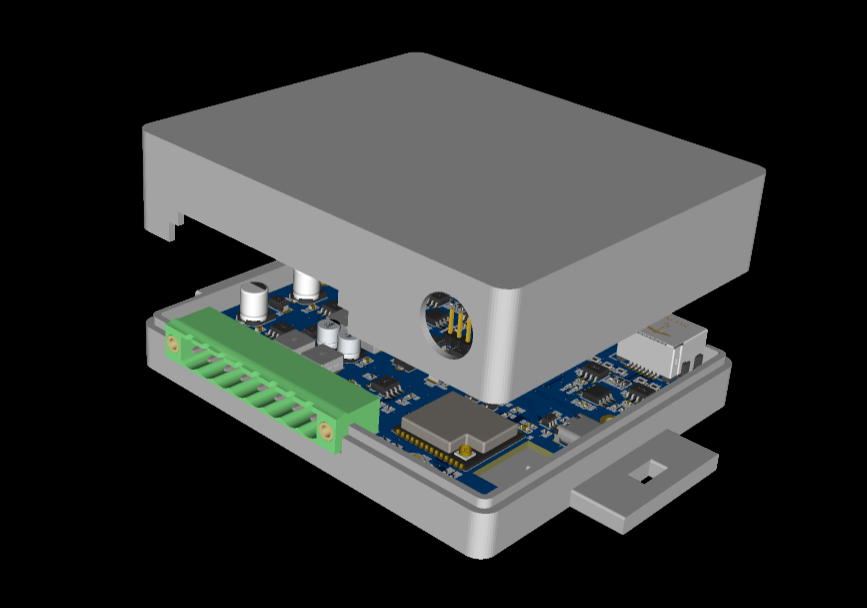
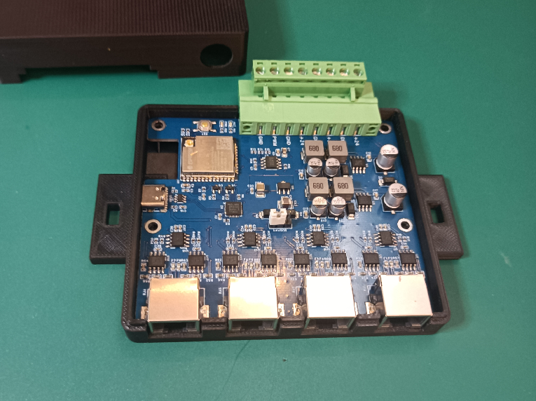

# PCBCrew ™ ESP32 dI2C Hub

ESP32 dI2C (differntial I2C) Hub for Sensor Networking.

| 3D Preview                                                       | PCBA                                                         |
| ---------------------------------------------------------------- | ------------------------------------------------------------ |
|  |  |

### Project Ownership

This repository is hosted to the PCB desiber([DumTux](https://github.com/dumtux))'s GitHub account for backup.
The copyright of this hardware design is owned by [BUILDING OPTIMIZATION TECHNOLOGIES ™](https://www.bldgot.com/).

### Sponsors:

* [BUILDING OPTIMIZATION TECHNOLOGIES ™](https://www.bldgot.com/)
* [PCBCrew ™](https://pcbcrew.com/)
